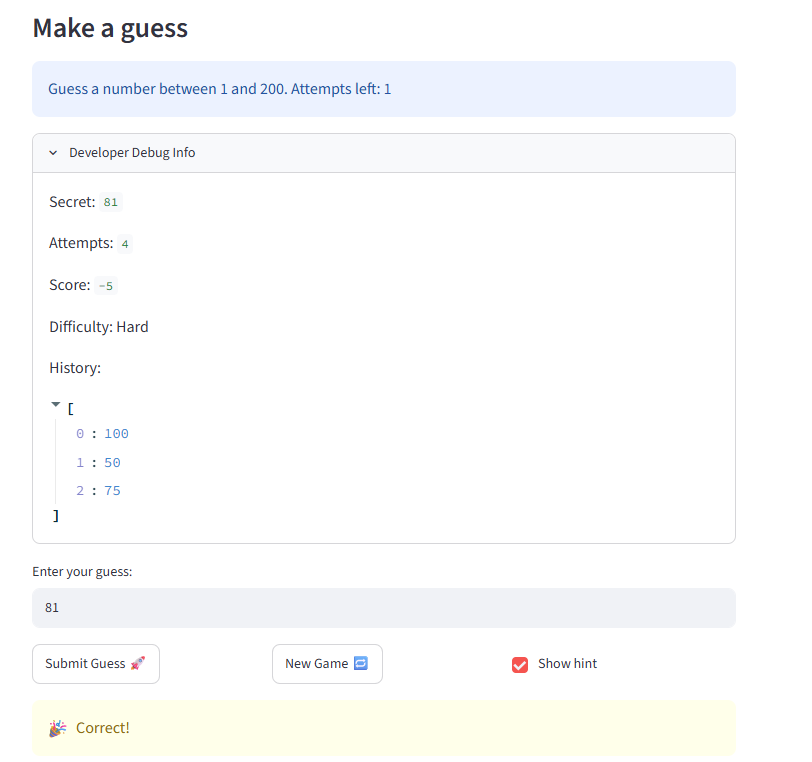
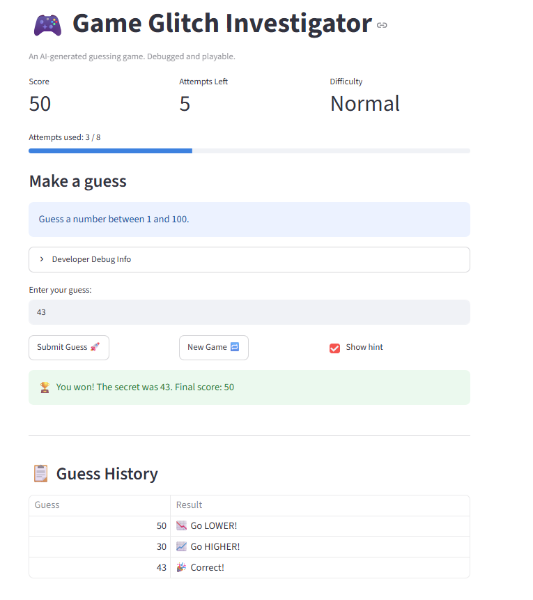

# 🎮 Game Glitch Investigator: The Impossible Guesser

## 🚨 The Situation

You asked an AI to build a simple "Number Guessing Game" using Streamlit.
It wrote the code, ran away, and now the game is unplayable. 

- You can't win.
- The hints lie to you.
- The secret number seems to have commitment issues.

## 🛠️ Setup

1. Install dependencies: `pip install -r requirements.txt`
2. Run the broken app: `python -m streamlit run app.py`

## 🕵️‍♂️ Your Mission

1. **Play the game.** Open the "Developer Debug Info" tab in the app to see the secret number. Try to win.
2. **Find the State Bug.** Why does the secret number change every time you click "Submit"? Ask ChatGPT: *"How do I keep a variable from resetting in Streamlit when I click a button?"*
3. **Fix the Logic.** The hints ("Higher/Lower") are wrong. Fix them.
4. **Refactor & Test.** - Move the logic into `logic_utils.py`.
   - Run `pytest` in your terminal.
   - Keep fixing until all tests pass!

## 📝 Document Your Experience

- [x] **Game purpose:** A number guessing game where the player tries to guess a secret number within a limited number of attempts, receiving Higher/Lower hints each round. The difficulty setting changes the number range and attempt limit.
- [x] **Bugs found:** (1) Inverted Higher/Lower hints; (2) Secret converted to string on even attempts, breaking all comparisons; (3) Hard difficulty range was 1–50 (easier than Normal 1–100); (4) New Game button always used range 1–100 ignoring difficulty; (5) Attempts counter started at 1 instead of 0, causing negative display.
- [x] **Fixes applied:** Swapped hint messages in `check_guess`; removed the even/odd string conversion block; corrected Hard range to 1–200 and dynamic info text; updated New Game to use `low`/`high` from selected difficulty; initialized attempts to 0; refactored all logic into `logic_utils.py`.

## 📸 Demo Walkthrough

Sample game on **Normal** difficulty (range 1–100, secret = 42):

1. Open the app and select **Normal** difficulty — sidebar shows range 1–100, 8 attempts allowed.
2. Enter guess **50** → hint: "📉 Go LOWER!" — score unchanged, attempts left drops to 7.
3. Enter guess **25** → hint: "📈 Go HIGHER!" — attempts left: 6.
4. Enter guess **37** → hint: "📈 Go HIGHER!" — attempts left: 5.
5. Enter guess **43** → hint: "📉 Go LOWER!" — attempts left: 4.
6. Enter guess **42** → "🎉 Correct!" — balloons appear, score updates, game ends.
7. Guess history table below the game shows all 5 guesses with their hints.
8. Click **New Game** to reset score and attempts and play again at the same difficulty.

**Screenshot** *(optional)*: 

## 🧪 Test Results

```
pytest tests/ -v
============================= test session starts =============================
platform win32 -- Python 3.13.13, pytest-9.0.3
collected 3 items

tests/test_game_logic.py::test_winning_guess PASSED                      [ 33%]
tests/test_game_logic.py::test_guess_too_high PASSED                     [ 66%]
tests/test_game_logic.py::test_guess_too_low PASSED                      [100%]

============================== 3 passed in 0.10s ==============================
```

## 🚀 Stretch Features

- [x] Enhanced UI implemented:
  - Fixed misleading caption ("Something is off." → "Debugged and playable.")
  - Added score, attempts-left, and difficulty metrics row at the top
  - Added progress bar that fills as attempts are used; warns with ⚠️ in the last 2 attempts
  - Color-coded hints: green (win), yellow (too high), blue (too low)
  - Guess history table shown below the game, listing every guess and its result
  - Win triggers balloons animation; game-end state shows colored success/error banner
